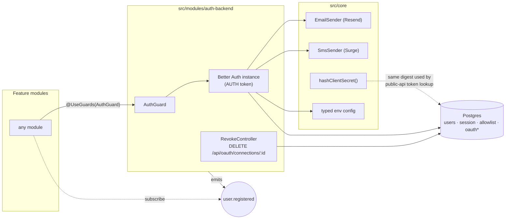
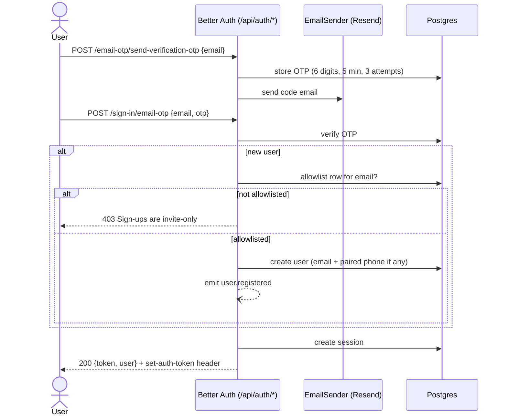
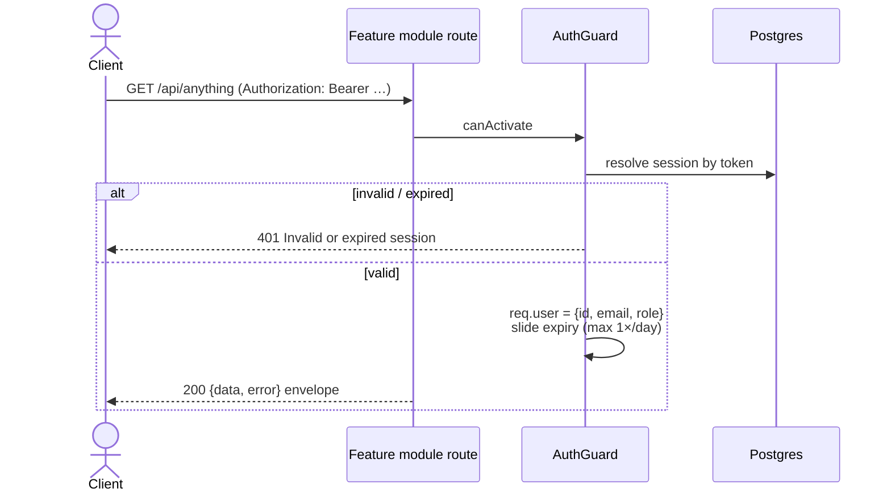
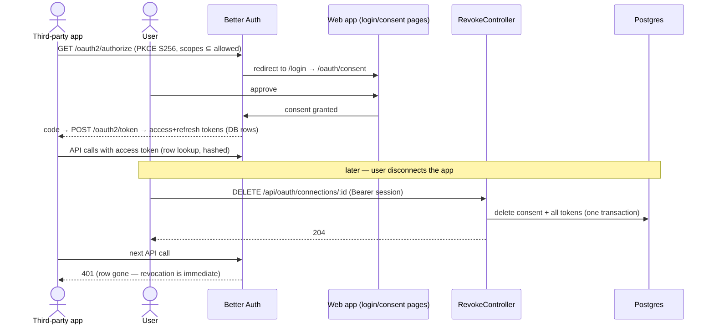

# auth-backend — Human docs

> Companion to [auth-backend.md](auth-backend.md). Reading only — generation
> uses the spec exclusively.

## What it does, in plain language

Passwordless, invite-only sign-in for a NestJS backend, built on Better Auth.
Users sign in with a 6-digit code sent to their email (Resend) or phone
(Surge SMS) — no passwords, no magic links. Only people already in an
`allowlist` table can create an account; everyone else gets "Sign-ups are
invite-only". A successful sign-in returns a Bearer token that *is* the
session: it slides forward as you use it and dies after 30 days idle
(configurable).

Feature modules protect routes with the exported `AuthGuard` and read
`req.user` (id, email, role). When a new user is created, the module emits a
`user.registered` event so other modules can react (welcome email, profile
setup) without being called directly.

It's also an OAuth 2.1 provider: third-party developer apps can request user
consent and access the public API. Users can revoke a connected app at any
time, and revocation is instant because tokens are checked against DB rows —
delete the row, the token is dead.

## Dependency map

## Sign-in flow (email OTP — SMS is identical with phone/Surge)

## Guarded request

## Third-party app (OAuth 2.1) + revocation

## What you must set up (digest)

- **Env vars**: `DATABASE_URL`, `BETTER_AUTH_SECRET`, `BETTER_AUTH_URL`,
  `AUTH_WEB_ORIGIN`, `RESEND_API_KEY`, `SURGE_API_KEY`, `SURGE_ACCOUNT_ID`
  (+ optional `AUTH_EMAIL_FROM`, `AUTH_TRUSTED_ORIGINS`).
- **Outside the module**: web pages for `/login` and `/oauth/consent`,
  verified Resend domain, Surge A2P registration, manual migrations for the
  owned tables, allowlist rows inserted by hand.
- **To consume it**: apply `@UseGuards(AuthGuard)`, subscribe to
  `user.registered`, and follow the `main.ts` mounting contract (raw body
  for `/api/auth/*`). Full details: spec's *Integration surface*.
