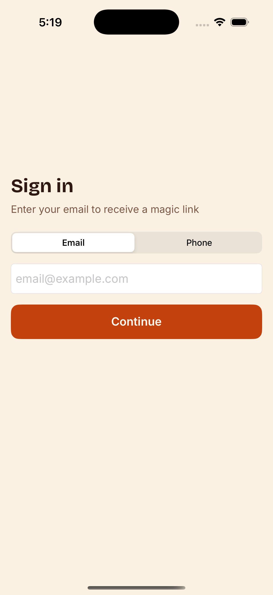
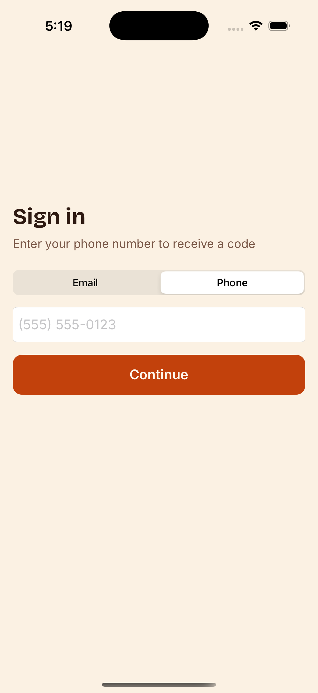
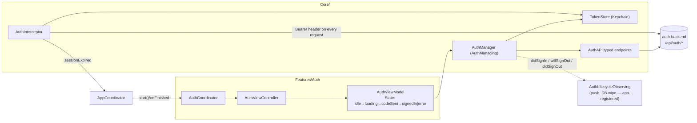
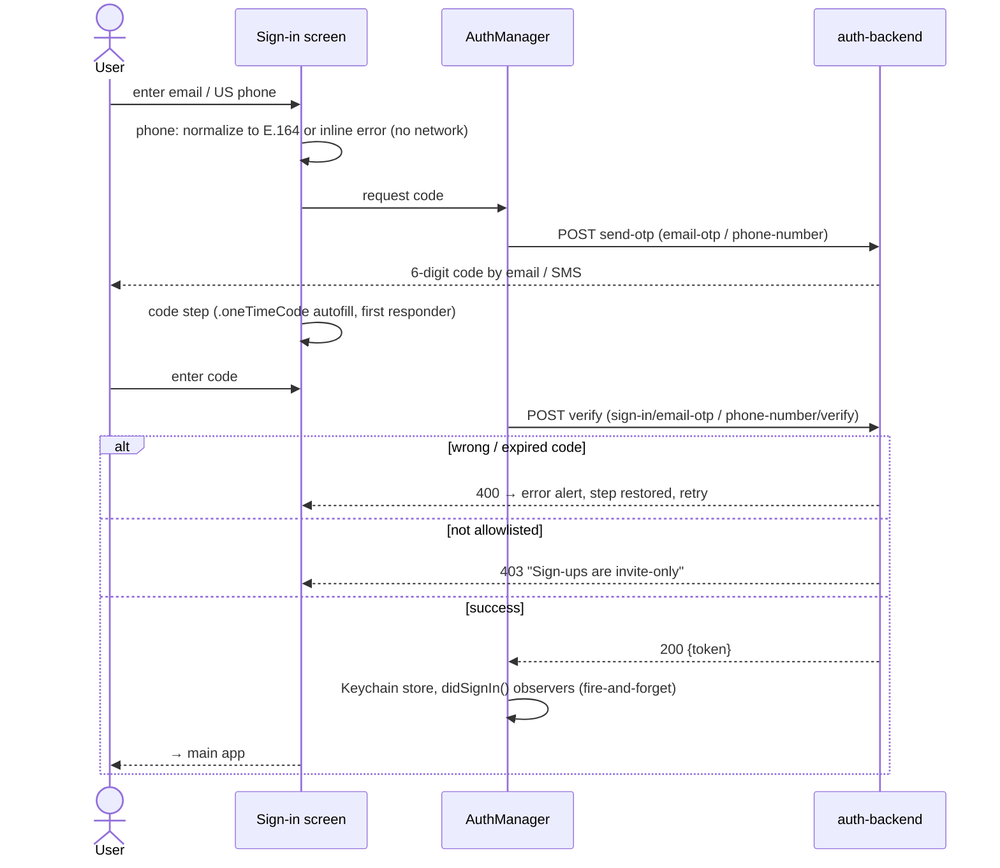
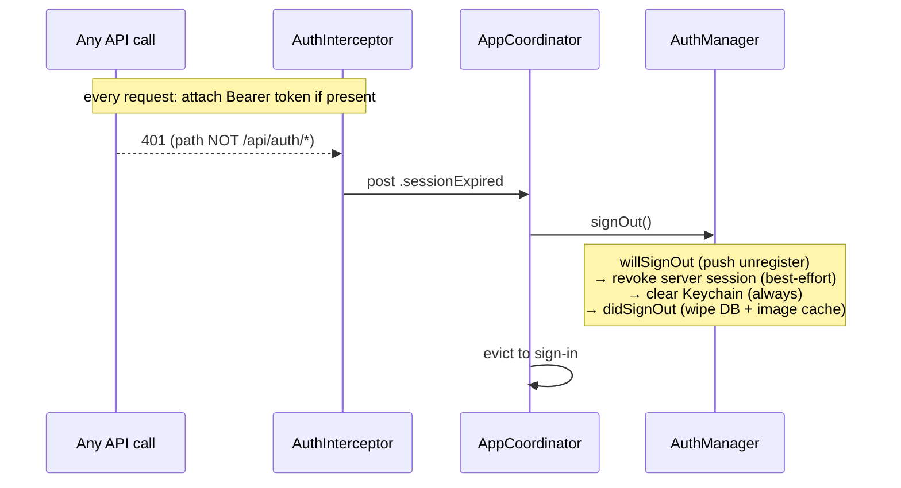

# auth-ios — Human docs

> Companion to [auth-ios.md](auth-ios.md). Reading only — generation uses
> the spec exclusively. Client half of [auth-backend](auth-backend.docs.md).

## What it does, in plain language

The sign-in screen and everything a session means on the device. One screen
with an Email/Phone toggle: enter your email or US phone number, receive a
6-digit code, type it (iOS autofills it from Messages/Mail), and you're in.
The returned Bearer token is stored in the Keychain and attached to every
API request from then on.

There is no refresh token — the token *is* the session. If any ordinary API
call comes back 401, the session is dead (expired or revoked server-side):
the app silently signs out, wipes everything the account left on the device
(database rows, cached images), and drops you back at sign-in. Errors on the
auth endpoints themselves (a wrong code) are just form errors — they never
end the session.

Sign-out does things in a deliberate order: first tell the server to stop
pushing to this device (while the session can still authorize that), then
revoke the session (best-effort), then always clear the token and wipe local
account data — so the next person to sign in inherits nothing.

The app plugs into session boundaries via `AuthLifecycleObserving`
(didSignIn / willSignOut / didSignOut) instead of the auth module knowing
about push or the database directly.

## Screens

The extracted app, as built (its email path still shows magic-link copy —
the spec replaces it with the same code-entry step the phone path uses):

| Sign-in — email | Sign-in — phone |
|---|---|
|  |  |

## Dependency map

## Sign-in flow (email and phone are symmetric)

## Session lifecycle

Launch is optimistic: a token in the Keychain routes straight to the main
app without validation — a stale token is evicted by the first 401.

## What you must set up (digest)

- **Build config**: per-environment API base URL; a Keychain service id.
- **Parameters**: phone region normalizer (must match auth-backend's
  validator), screen copy, legacy Keychain keys to clean up.
- **To consume it**: mount `AuthCoordinator` when unauthenticated, subscribe
  to `.sessionExpired`, install `AuthInterceptor` on the shared `APIClient`,
  and register `AuthLifecycleObserving` observers for push registration and
  account-data wipe. Full details: spec's *Integration surface*.
- **Routing order**: the [onboarding-ios](onboarding-ios.docs.md) gate runs
  first on a fresh install; sign-in second; main app third.
