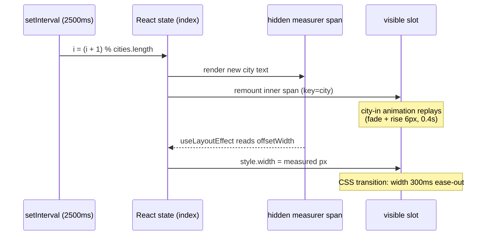
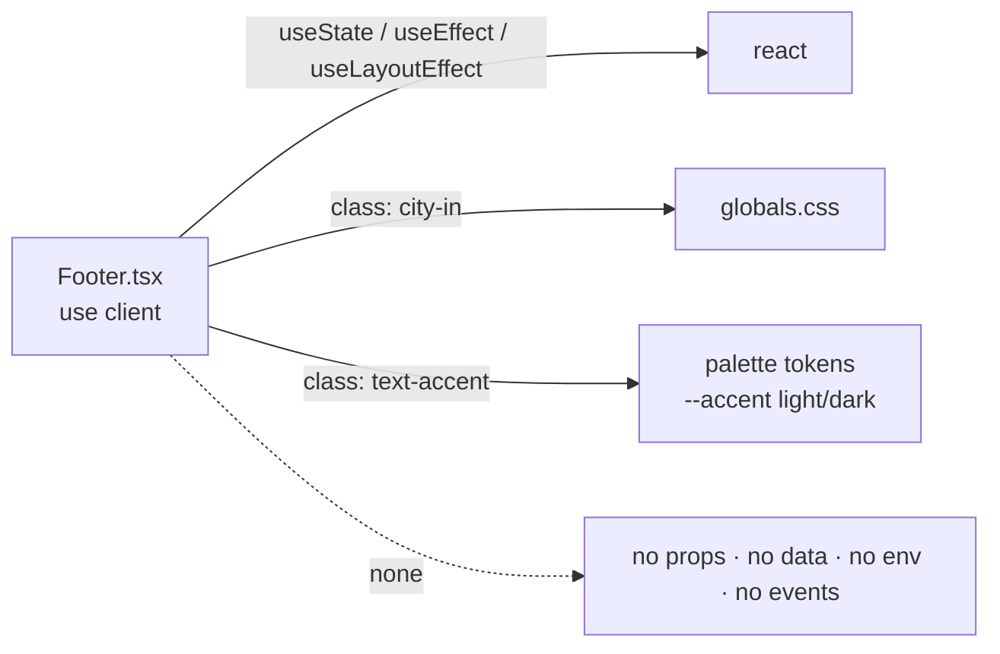

# footer-web — Docs (human companion)

> Companion doc for humans. Never an input to generation — the spec
> (`footer-web.md`) is the single source of truth.
>
> Extracted from `jony.money-landing` → `src/components/Footer.tsx` +
> supporting rules in `src/app/globals.css`. Live example: the footer at
> <https://jony.money> (no screenshot asset — captured live instead; the
> module is a single centered text block).

## What it does

A site footer that reads **"Built with ♥ from `<city>`"** and cycles the city
through a fixed list of places, one every 2.5 seconds, forever. The trick that
makes it feel polished: the city sits in a slot whose **width animates to each
name's real rendered width**, so the sentence keeps a normal single space
around the name and glides between short and long names instead of jumping.
Each incoming name also fades in while rising 6px. A smaller copyright line
sits below.

It is a pure presentational client component: no props, no data fetching, no
env vars. The city list is a constant in the file.

## Tick cycle (per city change)



The measurement runs in `useLayoutEffect` (synchronously after DOM update,
before paint) so the slot never paints at a stale width. On the very first
render the slot has no width set (`auto`) until the first measurement lands.

## Dependency map



CSS it relies on (from `globals.css`):

```css
@keyframes city-in {
  from { opacity: 0; transform: translateY(6px); }
  to   { opacity: 1; transform: none; }
}
@media (prefers-reduced-motion: no-preference) {
  .city-in { animation: city-in 0.4s ease; }
}
```

Plus Tailwind utilities on the slot itself:
`inline-block overflow-hidden whitespace-nowrap align-bottom font-medium
text-foreground transition-[width] duration-300 ease-out`.

## The places (current values in the source project)

Ordered "recent stops this year, newest first"; loops forever:

Mexico City, Oaxaca, Puerto Escondido, Coyoacán, San Francisco, Seattle,
Portland, Bend, Salt Lake City, Yosemite, Big Sur, Zion, Tokyo, Kyoto,
Nagano, Furano.

## Style surface

- Footer: centered, `text-sm`, muted gray (`text-gray-600` /
  `dark:text-gray-400`), `mt-16`, `position: relative` (anchors the hidden
  measurer).
- ♥: accent token — `#8e4e75` light / `#c9799f` dark in the source project.
- City name: `font-medium`, full foreground color (`#2c1120` / `#f1eee4`) —
  reads stronger than the surrounding sentence.
- Copyright line: `text-xs`, `mt-2` — "© 2026 Jony Money".

## Integration surface

- Drop-in component: render `<Footer />` at the end of the page. No props.
- Requires the `city-in` keyframes and the palette tokens (`--accent`,
  foreground) to exist in global CSS.
- Must run as a client component (state + timers + DOM measurement).
