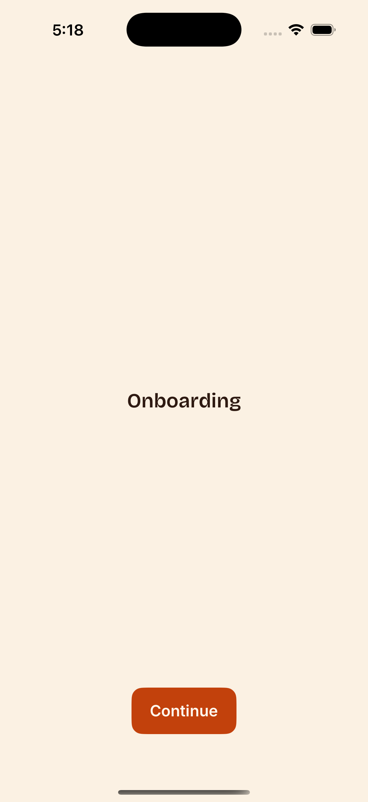
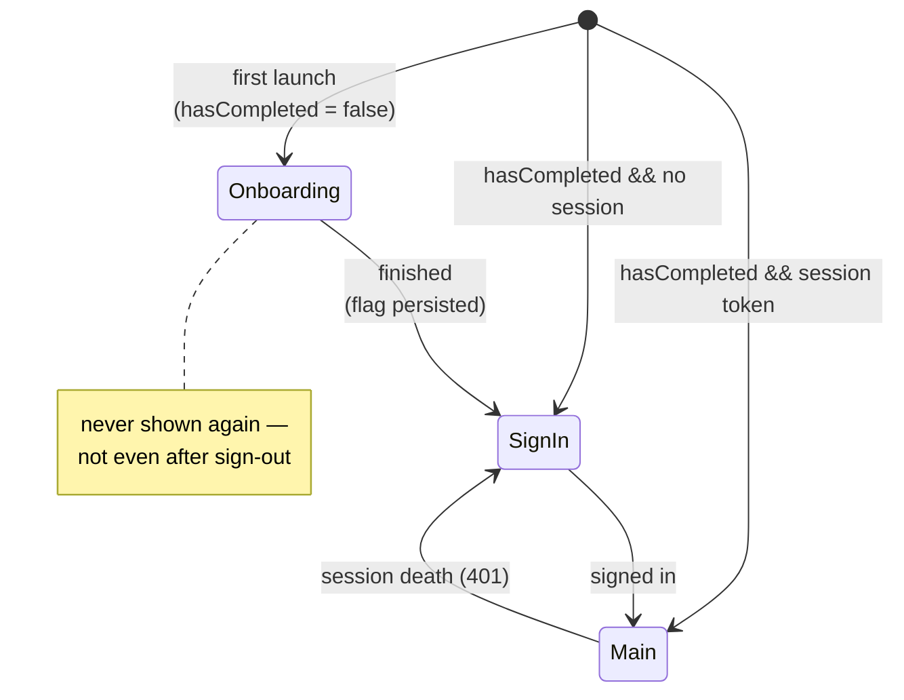

# onboarding-ios — Human docs

> Companion to [onboarding-ios.md](onboarding-ios.md). Reading only —
> generation uses the spec exclusively.

## What it does, in plain language

The first thing a fresh install shows: a short sequence of static
introduction screens, shown exactly once, before sign-in. Completing it
flips a persisted per-install flag; from then on the app boots straight to
sign-in (or the main app, if a session exists). Signing out later does NOT
bring onboarding back — it's per-install, not per-session.

The screens themselves are pure content — title, copy, an SF Symbol or
image per page — supplied as spec parameters. The module owns the gate, the
flag, and the paging scaffold; it makes no network calls and has no failure
modes.

## Screen

The extracted app's onboarding, as built (a placeholder — the spec
generalizes it to a parameterized page sequence):

## Where it sits in launch routing

The app coordinator owns this routing; the module contributes the
`hasCompleted` flag and a coordinator with `start()` + `onFinished`.

## What you must set up (digest)

- **Parameters**: the `SCREENS` array (title / body / symbol per page) and
  the two button labels.
- **To consume it**: at launch, mount `OnboardingCoordinator` as root when
  `settings.onboarding.hasCompleted` is false; in `onFinished`, set the flag
  and route to sign-in ([auth-ios](auth-ios.docs.md)).
- Artwork beyond SF Symbols goes in the consuming app's asset catalog.
