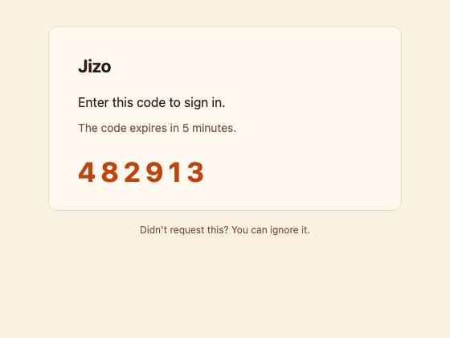
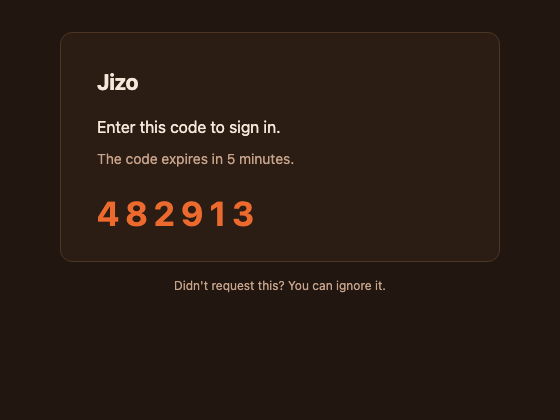
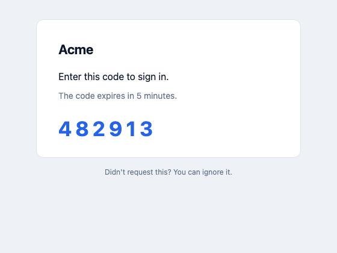
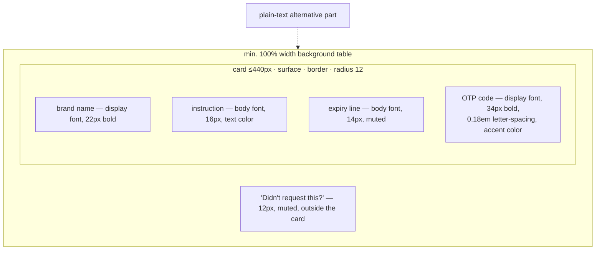
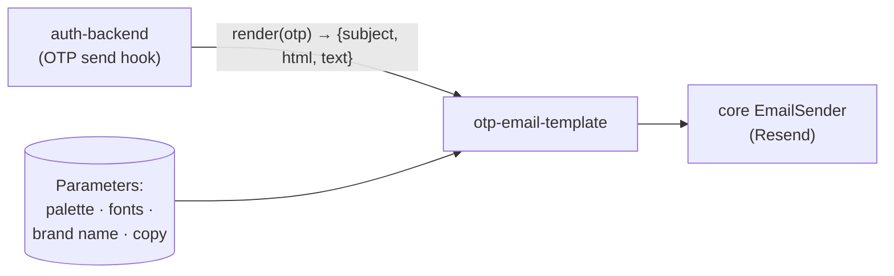

# otp-email-template — Human docs

> Companion to [otp-email-template.md](otp-email-template.md). Reading only —
> generation uses the spec exclusively. Consumed by
> [auth-backend](auth-backend.docs.md)'s email sender.

## What it does, in plain language

The one transactional email the OTP sign-in flow sends, as a reusable
layout. A centered card on a soft background: brand name up top in the
display face, one instruction line, a muted expiry line, and the 6-digit
code big, bold, letter-spaced, in the accent color. A "didn't request this?"
line sits below the card. Every email ships an HTML part and a plain-text
part.

The layout is the module; the look is parameters. Seven color roles —
supplied **twice, as a light palette and a dark palette** — two font stacks,
the brand name, and the copy strings are all per project; the same skeleton
renders any brand:

| Light palette | Dark palette | Different project, same skeleton |
|---|---|---|
|  |  |  |

## Why it's built the way it is

Email clients are hostile renderers. The template therefore uses:

- **Table layout with inline styles only** — no stylesheet, no external
  assets, no images; survives Outlook/Gmail/Apple Mail alike.
- **Light baseline inlined, dark by media query**: every element carries its
  light color inline (the style all clients can render), and an embedded
  `<style>` block swaps to the dark palette under
  `prefers-color-scheme: dark` (`color-scheme: light dark` metas). Clients
  that strip `<style>` simply get the light version — never a broken one.
- **Font fallbacks that matter**: custom faces rarely load in email, so the
  brand stacks degrade to system fonts by design.
- **Code-first subject line** (`482913 is your … sign-in code`) so the code
  is readable from the notification banner without opening the email.

## Structure

## Where it sits

## What you must set up (digest)

- **Parameters**: the seven color roles × two palettes (light + dark),
  display/body font stacks, brand name, instruction/expiry/footer copy, and
  the subject pattern.
- **No env vars, no endpoints, no events** — it's a pure render function the
  auth module's email sender calls.
- Sending, rate limits, and OTP policy all live in
  [auth-backend](auth-backend.docs.md); the expiry copy here must match the
  policy there (5 minutes by default).
